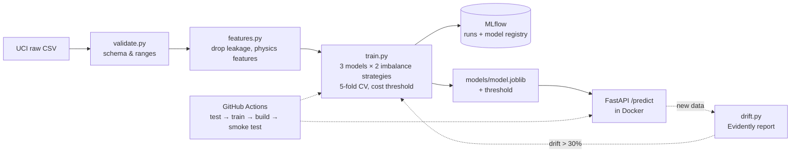

# Predictive Maintenance with an MLOps Pipeline

A model reads a milling machine's sensor values (temperature, speed, torque, tool wear) and predicts whether it is about to fail. An automated pipeline around it validates the data, trains and compares models, tracks experiments, registers the best model, serves it through an API, and watches for data drift.



## Results

Held-out test set: 2,000 machines, 68 of them real failures. Each model uses its own decision threshold, chosen on cross-validated training predictions (see "Decision threshold" below).

| Model | Imbalance handling | CV PR-AUC | Test PR-AUC | Test recall | Test precision | Test F1 | Cost* |
|---|---|---|---|---|---|---|---|
| **Random Forest** ✅ | class weights | **0.890** | 0.879 | **0.838** | **0.905** | **0.870** | **116** |
| XGBoost | SMOTE | 0.877 | 0.875 | 0.824 | 0.727 | 0.772 | 141 |
| XGBoost | class weights | 0.877 | 0.889 | 0.838 | 0.760 | 0.797 | 128 |
| Random Forest | SMOTE | 0.861 | 0.858 | 0.868 | 0.541 | 0.667 | 140 |
| Logistic Regression | class weights | 0.455 | 0.430 | 0.603 | 0.369 | 0.458 | 340 |
| Logistic Regression | SMOTE | 0.438 | 0.431 | 0.794 | 0.277 | 0.411 | 281 |

\*Cost = 10 × missed failures + 1 × false alarms. Always predicting "no failure" scores **96.6% accuracy** and costs **680**.

On the test set, the selected model catches **57 of 68 failures** and raises **6 false alarms**.

- **Selection is done on CV PR-AUC, not on the test set.** XGBoost with class weights has a slightly higher *test* PR-AUC, but choosing a model by its test score would leak the test set into model selection.
- **Logistic regression cannot capture the failure rules.** They are threshold-shaped (power too low *or* too high), which is not linear in the features.
- **Class weights beat SMOTE here.** SMOTE invents failures by interpolating between real ones, which blurs the sharp physical boundaries and costs precision.

## Key decisions

### 1. Leakage: the failure-type columns are dropped
`TWF, HDF, PWF, OSF, RNF` record *which kind* of failure happened, which is only known after it happens. They agree with `Machine failure` on 9,973 of 10,000 rows. The exceptions: 18 rows (mostly random failures) are flagged but not counted as failures, and 9 failures carry no flag.

| Same Random Forest | PR-AUC | Recall | Precision |
|---|---|---|---|
| with the flags | 0.972 | 0.971 | 1.000 |
| flags dropped (honest) | 0.892 | 0.809 | 0.965 |

The ID columns (`UDI`, `Product ID`) are also dropped. See `notebooks/01_eda.ipynb`.

### 2. Physics-based features
| Feature | Physical meaning | Targets |
|---|---|---|
| `temp_diff_k` = process − air temperature | small gap → heat can't dissipate | heat dissipation failure |
| `power_w` = torque × rpm × 2π/60 | mechanical power; failures at both extremes | power failure |
| `wear_torque` = tool wear × torque | strain on a worn tool | overstrain failure |

SHAP confirms the model uses them as physics predicts: rpm, power and torque matter most, and a small temperature gap and high wear × torque push toward failure.


### 3. Decision threshold (from a business assumption, not 0.5)
Assumption: **a missed failure costs 10× a false alarm** (unplanned downtime vs. a wasted inspection). The threshold that minimises `10·FN + 1·FP` is picked on 5-fold out-of-fold training predictions. For the selected model it is **0.36**. Change `COST_FN`/`COST_FP` in `src/config.py` to encode a different maintenance policy.

### 4. Split and resampling done without leakage
The train/test split is stratified 80/20, so both sets keep the 3.4% failure rate. Scaling and SMOTE sit *inside* an `imblearn` pipeline, so each CV fold fits them on its own training portion only.

### 5. Drift monitoring
`src/drift.py` compares the training data with two batches using Evidently:

| Batch | Drifted features | Verdict |
|---|---|---|
| held-out test set (unchanged) | none | ok |
| simulated summer (air +4 K, process +2.5 K) | air_temp, process_temp, temp_diff | **retrain** (38% > 30% alert) |

HTML reports are written to `reports/drift_*.html`.

## Quickstart

```bash
make setup        # venv + dependencies (Python 3.10)
make pipeline     # download → validate → train (MLflow) → SHAP → drift
make test         # pytest
make serve        # API at http://localhost:8000/docs
make mlflow       # MLflow UI at http://localhost:5000
make docker       # build and run the API container
```

```bash
curl -X POST localhost:8000/predict -H "Content-Type: application/json" \
  -d '{"type":"L","air_temp_k":302.0,"process_temp_k":310.5,"rpm":1300,"torque_nm":65,"tool_wear_min":215}'
# {"failure_probability":0.96,"threshold":0.36,"failure_predicted":true,
#  "model_version":"pm-failure-classifier/v1 (random_forest__class_weight)"}
```

The API rejects physically impossible input with a 422 (negative torque, unknown product type, process colder than ambient, unknown fields). It returns 503 if no model is loaded.

## CI (GitHub Actions)
On every push: install dependencies → run tests (features, validation, metrics, drift, API) → ingest and train → build the Docker image → start the container and smoke-test `/health` and `/predict`. The tests use a small synthetic model, so they don't need the dataset.

## Project structure
```
src/
  config.py      paths, columns, cost assumption
  ingest.py      download from UCI
  validate.py    schema / type / range checks
  features.py    leakage removal + physics features (shared with the API)
  train.py       model comparison, MLflow tracking + registry
  evaluate.py    imbalance-aware metrics, cost-based threshold
  explain.py     SHAP global + per-prediction explanations
  drift.py       Evidently drift reports
app/main.py      FastAPI service
notebooks/       exploration and leakage check only
tests/           pytest suite
```

## Limitations
- **Synthetic data.** AI4I 2020 is generated to resemble a real milling machine, and its failure modes follow clean, explicit rules. Real sensor data would be noisier, and performance would be lower.
- **Snapshots, not time series.** Each row is an independent snapshot, not a sequence per machine. The model answers "failure or not" and cannot estimate remaining useful life.
- **Random failures (RNF) are unpredictable by design.** They are independent of the sensors, which puts a ceiling on recall.
- **The drift test is simulated.** A shifted copy of held-out data stands in for live production data.
- **Limited tuning.** Hyperparameters are sensible defaults rather than a full search.
