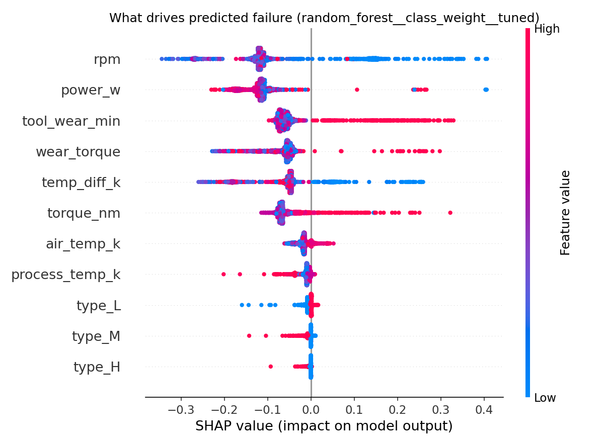
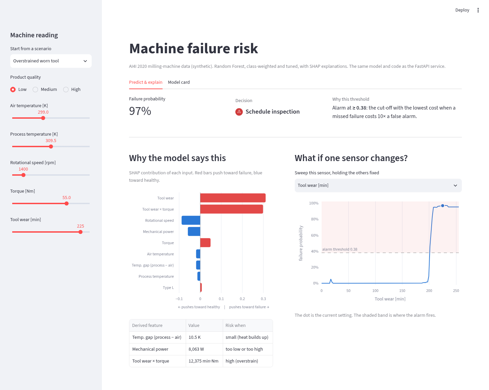

# Predictive Maintenance with an MLOps Pipeline

[](https://github.com/sarthak-bendre/predictive-maintenance/actions/workflows/ci.yml)

A model reads a milling machine's sensor values (temperature, speed, torque, tool wear) and predicts whether it is about to fail. An automated pipeline around it validates the data, trains and compares models, tracks experiments, registers the best model, serves it through an API, and watches for data drift.

```mermaid
flowchart LR
    A[UCI raw CSV] --> B[validate.py<br/>schema & ranges]
    B --> C[features.py<br/>drop leakage, physics features]
    C --> D[train.py<br/>3 models × 2 imbalance strategies<br/>+ tuned RF / XGBoost<br/>5-fold CV, cost threshold]
    D --> E[(MLflow registry<br/>@challenger)]
    E --> P{promote.py<br/>quality gate +<br/>beats @champion?}
    P -- yes --> F[models/model.joblib<br/>@champion + threshold]
    P -- no --> K[keep current champion]
    F --> G[FastAPI /predict<br/>probability + SHAP drivers<br/>in Docker]
    G -. new data .-> H[drift.py<br/>Evidently report]
    H -. drift > 30% .-> D
```

## Results

Held-out test set: 2,000 machines, 68 of them real failures. Each model uses its own decision threshold, chosen on cross-validated training predictions (see "Decision threshold" below).

| Model | Imbalance handling | CV PR-AUC | Test PR-AUC | Test recall | Test precision | Test F1 | Cost* |
|---|---|---|---|---|---|---|---|
| **Random Forest, tuned** ✅ | class weights | **0.900** | 0.895 | 0.853 | 0.841 | 0.847 | **111** |
| Random Forest | class weights | 0.890 | 0.879 | 0.838 | **0.905** | **0.870** | 116 |
| XGBoost | SMOTE | 0.877 | 0.875 | 0.824 | 0.727 | 0.772 | 141 |
| XGBoost, tuned | class weights | 0.877 | 0.883 | 0.853 | 0.725 | 0.784 | 122 |
| XGBoost | class weights | 0.877 | 0.889 | 0.838 | 0.760 | 0.797 | 128 |
| Random Forest | SMOTE | 0.861 | 0.858 | **0.868** | 0.541 | 0.667 | 140 |
| Logistic Regression | class weights | 0.455 | 0.430 | 0.603 | 0.369 | 0.458 | 340 |
| Logistic Regression | SMOTE | 0.438 | 0.431 | 0.794 | 0.277 | 0.411 | 281 |

\*Cost = 10 × missed failures + 1 × false alarms. Always predicting "no failure" scores **96.6% accuracy** and costs **680**.

On the test set, the selected model catches **58 of 68 failures** and raises **11 false alarms**.

- **Selection is done on CV PR-AUC, not on the test set.** The test set is used once, for the numbers above. Choosing a model by its test score would leak the test set into model selection, and the rankings do differ: untuned Random Forest has the best test F1 but the worse CV score.
- **Logistic regression cannot capture the failure rules.** They are threshold-shaped (power too low *or* too high), which is not linear in the features.
- **Tuning helps a little.** A 20-candidate randomized search (on PR-AUC) improves Random Forest from 0.890 to 0.900 CV PR-AUC and the test cost from 116 to 111. It catches one more failure in exchange for five more false alarms, which the 10:1 cost assumption accepts. Tuning XGBoost didn't improve it.
- **Class weights beat SMOTE here.** SMOTE invents failures by interpolating between real ones, which blurs the sharp physical boundaries and costs precision.

## Key decisions

### 1. Leakage: the failure-type columns are dropped
`TWF, HDF, PWF, OSF, RNF` record *which kind* of failure happened, which is only known after it happens. They agree with `Machine failure` on 9,973 of 10,000 rows. The exceptions: 18 rows (mostly random failures) are flagged but not counted as failures, and 9 failures carry no flag.

| Same Random Forest | PR-AUC | Recall | Precision |
|---|---|---|---|
| with the flags | 0.972 | 0.971 | 1.000 |
| flags dropped (honest) | 0.892 | 0.809 | 0.965 |

The ID columns (`UDI`, `Product ID`) are also dropped. See `notebooks/01_eda.ipynb`.

### 2. Physics-based features
| Feature | Physical meaning | Targets |
|---|---|---|
| `temp_diff_k` = process − air temperature | small gap → heat can't dissipate | heat dissipation failure |
| `power_w` = torque × rpm × 2π/60 | mechanical power; failures at both extremes | power failure |
| `wear_torque` = tool wear × torque | strain on a worn tool | overstrain failure |

SHAP confirms the model uses them as physics predicts: rpm and power matter most, followed by tool wear, wear × torque and the temperature gap; a small temperature gap and high wear × torque push toward failure.



### 3. Decision threshold (from a business assumption, not 0.5)
Assumption: **a missed failure costs 10× a false alarm** (unplanned downtime vs. a wasted inspection). The threshold that minimises `10·FN + 1·FP` is picked on 5-fold out-of-fold training predictions. For the selected model it is **0.38**. Change `COST_FN`/`COST_FP` in `src/config.py` to encode a different maintenance policy.

### 4. Split and resampling done without leakage
The train/test split is stratified 80/20, so both sets keep the 3.4% failure rate. Scaling and SMOTE sit *inside* an `imblearn` pipeline, so each CV fold fits them on its own training portion only.

### 5. Drift monitoring
`src/drift.py` compares the training data with two batches using Evidently:

| Batch | Drifted features | Verdict |
|---|---|---|
| held-out test set (unchanged) | none | ok |
| simulated summer (air +4 K, process +2.5 K) | air_temp, process_temp, temp_diff | **retrain** (38% > 30% alert) |

HTML reports are written to `reports/drift_*.html`.

### 6. Promotion gate: champion vs. challenger
Training never replaces the production model directly. It registers its best model in MLflow under the alias **`@challenger`**. Then `src/promote.py`:

1. **Quality gate.** Scores the challenger on the held-out test set. If recall is below 0.75 or PR-AUC is below 0.80, the step fails with exit code 1, which fails the pipeline.
2. **Head-to-head.** Scores the current **`@champion`** on the *same* test set, each model at its own threshold. The challenger is promoted only if it **lowers the business cost**; PR-AUC breaks ties.
3. **Promotion.** Moves the `@champion` alias to the winner and exports it to `models/` for the API image. Every decision is written to `reports/promotion.json`.

Example: retraining on the same data produced an identical model (cost 111 vs 111), so the gate kept v1:
```
PROMOTED challenger v1 (random_forest__class_weight__tuned) to @champion: no champion yet
KEPT champion v1: challenger v2 not better (cost 111 vs champion 111, PR-AUC 0.895 vs 0.895)
```

## Quickstart

```bash
make setup        # venv + dependencies (Python 3.10)
make pipeline     # download → validate → train (MLflow) → SHAP → drift
make test         # pytest
make serve        # API at http://localhost:8000/docs
make dashboard    # interactive demo at http://localhost:8501
make mlflow       # MLflow UI at http://localhost:5000
make docker       # build and run the API container
```

```bash
curl -X POST localhost:8000/predict -H "Content-Type: application/json" \
  -d '{"type":"L","air_temp_k":302.0,"process_temp_k":310.5,"rpm":1300,"torque_nm":65,"tool_wear_min":215}'
# {"failure_probability": 0.9718, "threshold": 0.38, "failure_predicted": true,
#  "top_drivers": [
#    {"feature": "rpm",         "value": 1300.0,  "contribution": 0.1695},
#    {"feature": "torque_nm",   "value": 65.0,    "contribution": 0.117},
#    {"feature": "wear_torque", "value": 13975.0, "contribution": 0.1053}],
#  "model_version": "pm-failure-classifier/v1 (random_forest__class_weight__tuned)"}
```

Each prediction includes `top_drivers`: the SHAP contributions that pushed this machine toward failure. A maintenance planner sees *why* a machine was flagged (here: slow spindle, high torque and a worn tool under load), not just a score. The SHAP explainer is built once at startup, and a prediction with explanation takes about 30 ms.

The API rejects physically impossible input with a 422 (negative torque, unknown product type, process colder than ambient, unknown fields). It returns 503 if no model is loaded.

## Demo dashboard

`make dashboard` opens a Streamlit app that uses the same model and feature code as the API:
- **Scenarios** for each failure mode (heat dissipation, power too low / too high, overstrain) plus a healthy machine. Sliders adjust any sensor.
- **Decision**: failure probability and the alarm decision at the cost-based threshold.
- **Why the model says this**: SHAP contribution of every input for this machine.
- **What if**: sweep one sensor and watch the risk cross the alarm threshold. For example, the overstrained tool crosses it at about 200 minutes of wear.
- **Model card**: test metrics, every candidate model, the last promotion decision and the drift status.



## Automation (GitHub Actions)

**CI (`ci.yml`)** runs on every push: install dependencies → run tests (features, validation, metrics, promotion logic, drift, API, dashboard) → ingest, train and **promote (the quality gate)** → build the Docker image → start the container and smoke-test `/health` and `/predict`. The tests use a small synthetic model, so they don't need the dataset.

**Monitoring (`monitor.yml`)** runs twice a week, or on demand with a chosen scenario:
```
ingest → split → drift check ──no drift──▶ done
                      │
                   drift > 30%
                      ▼
                retrain → promotion gate → save registry → upload model + reports
```
The MLflow registry (`mlflow.db`, `mlruns/`) is carried between runs in the Actions cache, so each retrain has to beat the champion from earlier runs. The drift report, gate decision and model are attached to the run as artifacts, and a summary appears on the run page. To try it: **Actions → Monitor drift and retrain → Run workflow → `summer`**.

## Project structure
```
src/
  config.py      paths, columns, cost assumption
  ingest.py      download from UCI
  validate.py    schema / type / range checks
  features.py    leakage removal + physics features (shared with the API)
  train.py       model comparison, MLflow tracking, registers @challenger
  promote.py     quality gate + champion/challenger promotion
  evaluate.py    imbalance-aware metrics, cost-based threshold
  explain.py     SHAP global plots + per-prediction drivers (used by the API)
  drift.py       Evidently drift reports
app/main.py      FastAPI service
dashboard/app.py Streamlit demo (predict, explain, what-if, model card)
notebooks/       exploration and leakage check only
tests/           pytest suite
```

## Limitations
- **Synthetic data.** AI4I 2020 is generated to resemble a real milling machine, and its failure modes follow clean, explicit rules. Real sensor data would be noisier, and performance would be lower.
- **Snapshots, not time series.** Each row is an independent snapshot, not a sequence per machine. The model answers "failure or not" and cannot estimate remaining useful life.
- **Random failures (RNF) are unpredictable by design.** They are independent of the sensors, which puts a ceiling on recall.
- **Retraining has no new labels.** The dataset is static, so a drift-triggered retrain reuses the same data. In production, the incoming batch would be labelled once failures are confirmed and appended to the training data in `ingest.py`.
- **The registry lives in the Actions cache.** That's fine for a demo, but GitHub evicts caches unused for 7 days. A real deployment would use a hosted MLflow tracking server.
- **The drift test is simulated.** A shifted copy of held-out data stands in for live production data.
- **Tuning is not nested.** The hyperparameter search and the CV estimate use the same training data (different fold seeds), so the tuned models' CV scores are slightly optimistic. The untouched test set gives the unbiased check.
